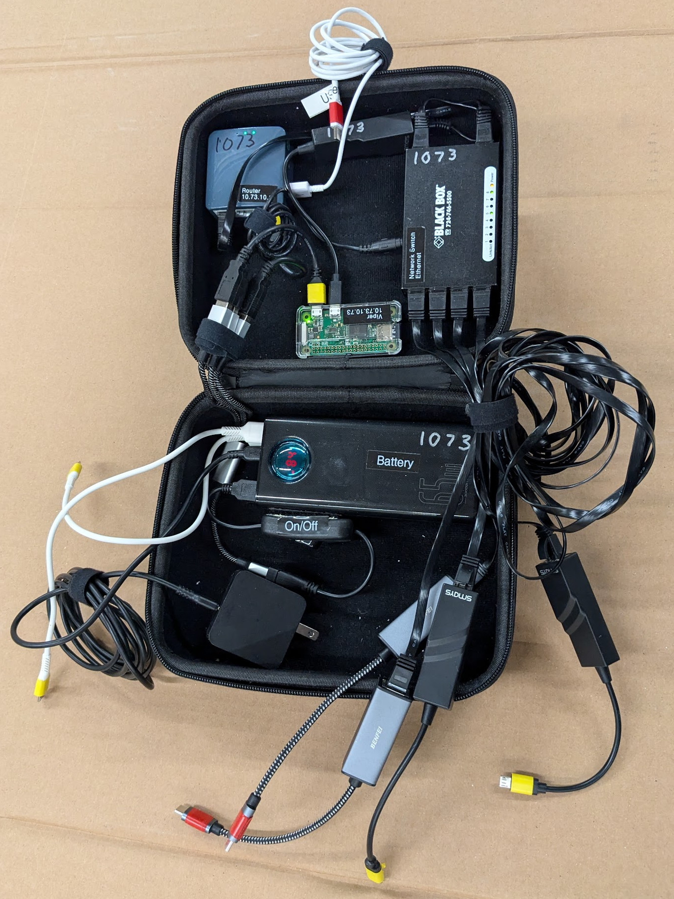

# Hardware for Viper Scouting System

The total cost of all the recommend hardware is around $930 (as of 2025), two thirds of which is the clients. The system is flexible and will run on a wide variety of hardware, so feel free to make substitutions or reuse hardware you may already own.

## Server

Because WiFi hotspots are disallowed near the field, it is best to run this application with wired ethernet. It will need to run on batteries because there are almost never power outlets in the stands. The scouting server runs on any device with a Linux, Apache, and Perl stack. The following energy efficient hardware that can last all day on a single charge and costs about $300.

 - $40 [Pi Zero W w/ case](https://www.amazon.com/dp/B0748MPQT4) — Small computer that runs the scouting app
 - $54 [USB Power bank](https://www.amazon.com/dp/B08JV4W4NY)  — Can power the system for about a week straight, automatically turns on and off based on whether or not anything is plugged into it.
 - $30 [Charging plug](https://www.amazon.com/dp/B08786SHXV) — To plug in the power bank for charging
 - $31 [Travel router](https://www.amazon.com/dp/B0777L5YN6) — Manages the network connectivity (DHCP server)
 - $23 [Case](https://www.amazon.com/dp/B019BIWJ8W) — Pretty good size for all the server components
 - $9 [Network switch](https://www.amazon.com/dp/B079JP94QQ) — 5v USB powered
 - $32 (4 @ $8) [USB C to Ethernet](https://www.amazon.com/dp/B08JGL51M4) — Plugs into newer tablets, good to have a few
 - $13 [USB Splitter](https://www.amazon.com/dp/B09NBVDP5Z) — Splits power to several USB components (the pi, the router, the switch) so that they can all be on one on/off switch
 - $8 [USB On/Off Switch](https://www.amazon.com/dp/B07CG2VGWG) — To turn the system off in one button
 - $14 [Micro USB to Ethernet](https://www.amazon.com/dp/B01AT4C3KQ) — Connects the Pi to the wired network (older tablets may also need these)
 - $13 [5 pack flat ethernet cable, 6 inch](https://www.amazon.com/dp/B01HC11V4I) — Flat cables take up little room.  Short cables are good for connecting components within the case
 - $15 [5 pack flat ethernet cable, 4 foot](https://www.amazon.com/dp/B01G2SJU8Q) — Flat cables take up little room, 4 ft cables are for connecting to tablets

## Clients

You need six clients to use the system (one for each robot on the field.)  We recommend Android tablets for clients. If you can't afford the tablets, or want to try the system out before investing, your existing Android phones and laptop computers can work with the system.  Note that Apple iPhones and iPads can't use wired USB ethernet and won't work with the system.

 - $396 (6 @ $66) [Android tablet with 10.1" screen](https://www.amazon.com/dp/B0DDPMJD8H) — Cheap tablets are fine for scouting
 - $108 (6 @ $18) [Tablet case](https://www.amazon.com/dp/B0DP4RVDZZ?) — Get cases that match your tablets. Consider 3 red and 3 blue cases.
 - $75 [Hard case](https://www.amazon.com/dp/B08ZVTV2SH) — 18" hard case can hold the tablets and charger
 - $24 [Six port USB charger](https://www.amazon.com/dp/B0779D7DFG) — Charge all your tablets at once (with plug for car outlet)
 - $14 (2 @ $7) [5 pack short USB-C cables](https://www.amazon.com/dp/B0B3RDHYYR) — Short cables eliminate cord clutter
 - $14 [12v 5A power supply](https://www.amazon.com/dp/B075FPQ2YQ) — To plug the charger into a wall outlet.
 - $7 [Car outlet socket](https://www.amazon.com/dp/B01FJ8OXX2) — To attach the charger to a robot battery so that you can charge tablets in the stands
 - $17 [Robot battery connectors](https://www.amazon.com/dp/B0CJ8XR5PN) — To attach the charger to a robot battery so that you can charge tablets in the stands

## Server Configuration

Everything is attached to the inside of the case with velcro.

### Battery

The battery has the following plugged into it:

 - Wall plug for charging into the USB-C input
 - USB switch with a three way splitter
 - Some short USB cords for charging tablets at events

### Router

The router has the following plugged into it:

 - Ethernet cord to the network switch
 - USB power from the splitter
 - A USB cord to plug in a phone that can share its network connection with the system via USB tethering

### Network switch

 - Power from the USB splitter
 - Ethernet to the router
 - Ethernet to the Raspberry Pi
 - Ethernet for four tablets

### Raspberry Pi

 - Ethernet via a micro-USB dongle
 - Power via micro-USB from the USB splitter

## Other documentation

 - [README](../README.md)
 - [Installing on Linux (Like a Raspberry Pi)](linux-install.md)
 - [Installing on Windows with XAMPP](windows-install.md)
 - [Development Environment with Docker](docker-install.md)
 - [Translation and Internationalization](translation.md)
