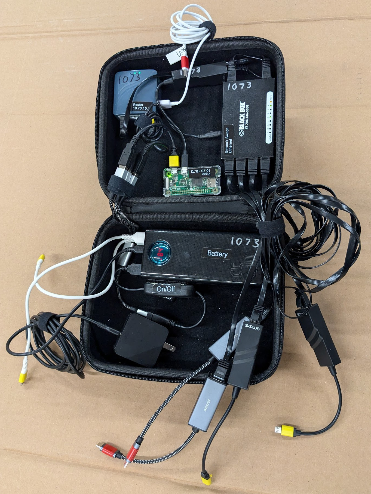
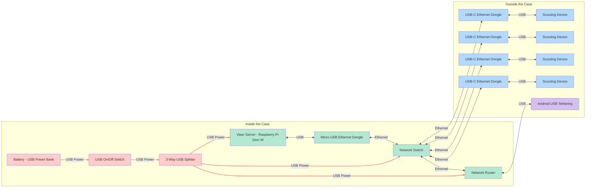

# Hardware for Viper Scouting System

The total cost of all the recommended hardware is around $930 (as of 2026), two thirds of which is the clients. The system is flexible and will run on a wide variety of hardware, so feel free to make substitutions or reuse hardware you may already own.

## Server

Because WiFi hotspots are disallowed near the field, it is best to run this application with wired ethernet. It will need to run on batteries because there are almost never power outlets in the stands. The scouting server runs on any device with a Linux, Apache, and Perl stack. The following energy efficient hardware that can last all day on a single charge and costs about $275.

 - $45 [Pi Zero W w/ case](https://www.amazon.com/dp/B0748MPQT4) — Small computer that runs the scouting app
 - $27 [USB Power bank](https://www.amazon.com/dp/B0GQZKGGQH) — The one I previously recommended is no longer available, but this one has high capacity and good reviews. I haven't confirmed that it turns off automatically when you unplug all devices from it.
 - $26 [Charging plug](https://www.amazon.com/dp/B08786SHXV) — To plug in the power bank for charging
 - $37 [Travel router](https://www.amazon.com/dp/B0777L5YN6) — Manages the network connectivity (DHCP server)
 - $26 [Case](https://www.amazon.com/dp/B019BIWJ8W) — Pretty good size for all the server components
 - $9 [Network switch](https://www.amazon.com/dp/B079JP94QQ) — 5v USB powered
 - $40 (4 @ $10) [USB C to Ethernet](https://www.amazon.com/dp/B0D9LCQS6J) — Plugs into newer tablets, good to have a few
 - $13 [USB Splitter](https://www.amazon.com/dp/B09NBVDP5Z) — Splits power to several USB components (the pi, the router, the switch) so that they can all be on one on/off switch
 - $8 [USB On/Off Switch](https://www.amazon.com/dp/B07CG2VGWG) — To turn the system off in one button
 - $14 [Micro USB to Ethernet](https://www.amazon.com/dp/B01AT4C3KQ) — Connects the Pi to the wired network (older tablets may also need these)
 - $14 [5 pack flat ethernet cable, 6 inch](https://www.amazon.com/dp/B01HC11V4I) — Flat cables take up little room.  Short cables are good for connecting components within the case
 - $16 [5 pack flat ethernet cable, 4 foot](https://www.amazon.com/dp/B01G2SJU8Q) — Flat cables take up little room, 4 ft cables are for connecting to tablets

## Clients

You need six clients to use the system (one for each robot on the field.)  We recommend Android tablets for clients. If you can't afford the tablets, or want to try the system out before investing, your existing Android phones and laptop computers can work with the system.  Note that Apple iPhones and iPads can't use wired USB ethernet and won't work with the system.

 - $354 (6 @ $59) [Android tablet with 10" screen](https://www.amazon.com/s?k=android+tablet+10+inch) — Cheap tablets are fine for scouting. They come with plastic screens which are less durabe than glass screens but have much better touch responsiveness which is important for scouting. The battery capacity is usually poor, so get supplemental batteries.  The cameras are also usually poor, so we typically take the robot pictures in pit scouting on phones.
 - $60 (6 @ $10) [Tablet case](https://www.amazon.com/dp/B0DZCJYZ18?) — Get cases that match your tablets. Consider 3 red and 3 blue cases.
 - $92 (6 @ $14) [Battery packs](https://www.amazon.com/dp/B0FC2NK1YR?) — For all-day use at competitions, I recommend two of these battery packs per tablet.  They are small enough they can be plugged into the tablet while in use and provide a few hours of battery power to the tables.
 - $75 [Hard case](https://www.amazon.com/dp/B08ZVTV2SH) — 18" hard case can hold the tablets and charger
 - $24 [Six port USB charger](https://www.amazon.com/dp/B0779D7DFG) — Charge all your tablets at once (with plug for car outlet)
 - $9 [6 pack short USB-C cables](https://www.amazon.com/dp/B0FB96S9KK) — Short cables eliminate cord clutter
 - $16 [12v 5A power supply](https://www.amazon.com/dp/B075FPQ2YQ) — To plug the charger into a wall outlet.
 - $7 [Car outlet socket](https://www.amazon.com/dp/B01FJ8OXX2) — To attach the charger to a robot battery so that you can charge tablets in the stands
 - $16 [Robot battery connectors](https://www.amazon.com/dp/B0CJ8XR5PN) — To attach the charger to a robot battery so that you can charge tablets in the stands

## Server Configuration

Everything is attached to the inside of the case with velcro.

```mermaid
graph LR
    Battery[Battery - USB Power Bank]
    OnOffSwitch[USB On/Off Switch]
    Splitter[3-Way USB Splitter]
    Router[Network Router]
    ServerUSBDongle[Micro-USB Ethernet Dongle]
    Switch[Network Switch]
    Server[Viper Server - Raspberry Pi Zero W]
    ClientDongle1[USB-C Ethernet Dongle]
    ClientDongle2[USB-C Ethernet Dongle]
    ClientDongle3[USB-C Ethernet Dongle]
    ClientDongle4[USB-C Ethernet Dongle]
    Client1[Scouting Device]
    Client2[Scouting Device]
    Client3[Scouting Device]
    Client4[Scouting Device]
    Tether[Android USB Tethering]

    subgraph Case["Inside the Case"]
        Battery
        OnOffSwitch
        Splitter
        Router
        ServerUSBDongle
        Switch
        Server
    end

    subgraph Outside["Outside the Case"]
		ClientDongle1
		ClientDongle2
		ClientDongle3
		ClientDongle4
		Client1
		Client2
		Client3
		Client4
		Tether
    end

    Battery -->|USB Power| OnOffSwitch
    OnOffSwitch -->|USB Power| Splitter
    Splitter -->|USB Power| Router
    Splitter -->|USB Power| Switch
    Splitter -->|USB Power| Server
    Switch <-->|Ethernet| Router
    Server <-->|USB| ServerUSBDongle
    ServerUSBDongle <-->|Ethernet| Switch
    Switch <-->|Ethernet| ClientDongle1
    Switch <-->|Ethernet| ClientDongle2
    Switch <-->|Ethernet| ClientDongle3
    Switch <-->|Ethernet| ClientDongle4
    ClientDongle1 <-->|USB| Client1
    ClientDongle2 <-->|USB| Client2
    ClientDongle3 <-->|USB| Client3
    ClientDongle4 <-->|USB| Client4
    Router <-->|USB| Tether

    style Battery fill:#FFCCCC
    style OnOffSwitch fill:#FFCCCC
    style Splitter fill:#FFCCCC
    style Router fill:#B3E8D3
    style ServerUSBDongle fill:#B3E8D3
    style Switch fill:#B3E8D3
    style Server fill:#B3E8D3
    style ClientDongle1 fill:#B3D9FF
    style ClientDongle2 fill:#B3D9FF
    style ClientDongle3 fill:#B3D9FF
    style ClientDongle4 fill:#B3D9FF
    style Client1 fill:#B3D9FF
    style Client2 fill:#B3D9FF
    style Client3 fill:#B3D9FF
    style Client4 fill:#B3D9FF
    style Tether fill:#D4BFEF

	linkStyle 0,1,2,3,4 stroke:#FF6B6B,stroke-width:2px
```

### Battery

The battery has the following plugged into it:

 - Wall plug for charging into the USB-C input
 - USB switch with a three way splitter
 - Some short USB cords for charging tablets at events

### Router

The router has the following plugged into it:

 - Ethernet cord to the network switch
 - USB power from the splitter
 - A USB cord to plug in a phone that can share its network connection with the system via USB tethering
 - [Instructions for configuring the router software](router-glinet.md)

### Network switch

 - Power from the USB splitter
 - Ethernet to the router
 - Ethernet to the Raspberry Pi
 - Ethernet for four tablets

### Raspberry Pi

 - Ethernet via a micro-USB dongle
 - Power via micro-USB from the USB splitter
 - [Instructions for install Viper on Linux](linux-install.md)

## Other documentation

 - [README](../README.md)
 - [Installing on Linux (Like a Raspberry Pi)](linux-install.md)
 - [Installing on Windows with XAMPP](windows-install.md)
 - [Development Environment with Docker](docker-install.md)
 - [Translation and Internationalization](translation.md)
