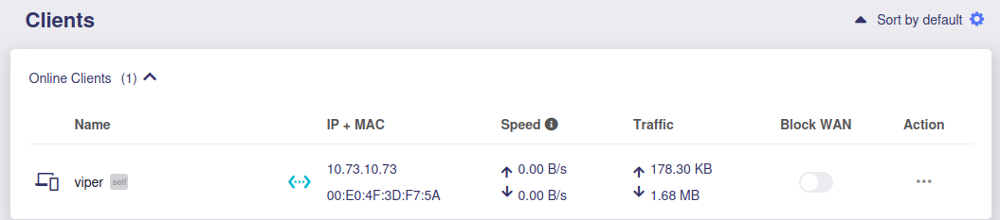
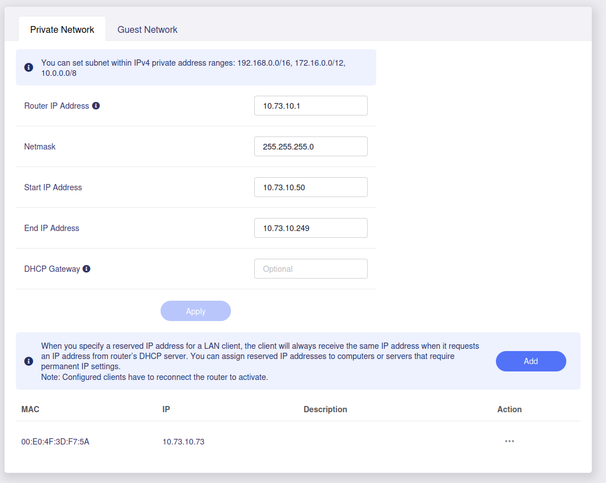

# GL-iNet Router for Viper

The GL-iNet brand of travel routers works very well for establishing a wired local area network at competitions.  See the [recommended hardware](hardware.md) for the specific model and other components needed.

## 1. Connect the router to your internet.

Follow [the manufacturer's instructions for initial router setup to get it connected to your local network](https://docs.gl-inet.com/router/en/4/user_guide/gl-ar300m/).

## 2. Configure the private network

Set up the network for the tablets and Raspberry Pi web server.

1. Navigate to `Network` → `LAN`
Choose an easy-to-remember IP address for Viper in a range reserved for private LANs.  Anything in the `10.x.x.x` format will work.  For example, if your team is `1234` you might choose `10.0.12.34`.  This is the address you'll need to type in your tablets' address bars to access the scouting system.  Since our team is `1073`, we use `10.73.10.73`.
3. Change the number after the last dot in that IP address to a `1` and enter it as the "Router IP Address".  (We use `10.73.10.1`)
4. Enter `255.255.255.0` as the `Netmask`
5. Change the number after the last dot in your IP address to a `50` and enter it as the `Start IP Address` (We use `10.73.10.50`)
6. Change the number after the last dot in your IP address to a `249` and enter it as the `End IP Address` (We use `10.73.10.249`)
7. Apply the settings and wait for the router to reboot.

## 3. Set up the IP for the Pi

1. Plug your Pi into the router via wired ethernet.
2. It will automatically get a random IP address for now.
3. Go to the `Clients` page in the router and find the MAC address of your Pi.  (Ours is `00:E0:4F:3D:F7:5A`).

   

4. Go back to the `Network` → `LAN`
5. Press the `Add` Button to add a new reserved IP address.
6. Enter the MAC of your Pi and that easy-to-remember IP address you came up with before.
7. Save it and reboot your Pi and Router
8. The final configuration should look something like this.
   

## 4. Connect your tablets

Now when you connect your tablets you should be able to enter `http://10.x.x.x` into the browser address bar to get to Viper.

## Other documentation

 - [README](../README.md)
 - [Recommended hardware](hardware.md)
 - [Installing on Linux (Like a Raspberry Pi)](linux-install.md)
 - [Installing on Windows with XAMPP](windows-install.md)
 - [Translation and Internationalization](translation.md)
