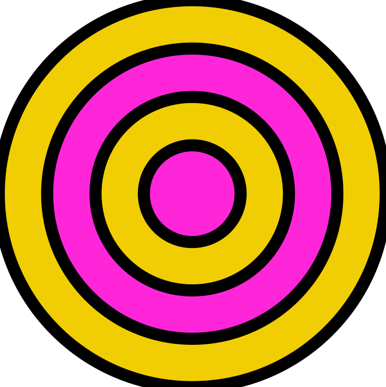
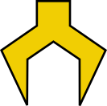

## Instrucciones de Scouting

### Salida de Combustible

La tarea de scouting más importante este año es contar el combustible que el robot logra llevar a su objetivo. Cuenta cualquier combustible que sea

- disparado
- colocado
- empujado
- arrastrado

**No cuentes** combustible que

- falla el objetivo
- es disparado al hub cuando el hub está inactivo

Hay varios objetivos posibles para el combustible:

- el hub (donde obtiene puntos cuando el hub está activo)
- descargado en el piso en la zona de alianza
- alimentado al puesto de avanzada (outpost)
- movido (pasado o empujado) de la zona neutral a la zona de alianza
- movido (pasado o empujado) de la zona del oponente a la zona neutral
- pasado de la zona del oponente a la zona de alianza

Hay tres botones para contar combustible. Son círculos amarillos (de color de combustible).

- 1 — cuando un robot dispara un combustible al objetivo
- 5 — cuando un robot dispara cinco combustibles al objetivo
- 10 — cuando un robot dispara diez combustibles al objetivo

### Seguimiento de Zona y Objetivo

Conforme el robot se mueve entre zonas, presiona las flechas  en los baches y depresiones para rastrear a qué zona se mueve el robot.

Cuando el robot entra en una zona, el objetivo más probable para el combustible se seleccionará automáticamente :

- Zona de alianza — el hub
- Zona neutral — zona de alianza
- Zona del oponente — zona de alianza

Haz clic en un objetivo diferente inactivo  para activarlo.

### Recolección en Auto

Solo en auto, marca si el robot recoge combustible del Depósito o del Puesto de Avanzada haciendo clic en el icono . Esto es solo un interruptor de encendido/apagado para saber si el robot recogió allí, no necesitas contar el combustible recogido.

### Nivel de Escalada

Haz clic en la Torre para cada nivel que el robot escala para registrar el nivel de escalada. Si haces clic conforme el robot alcanza un travesaño, obtendremos información de tiempo de escalada.

### Deshacer Errores

Hay un botón Deshacer tanto en auto como en tele que te permitirá deshacer el último botón presionado.

### Juego Final

Al final del encuentro, haz clic en la pestaña de juego final y responde preguntas adicionales sobre cómo se desempeñó tu robot en el encuentro.

### Guardando Tus Datos

Usa uno de los botones en la parte inferior para guardar los datos cuando termines. El botón sugerido será más grande — generalmente será el botón para avanzar al siguiente encuentro, pero en ciertos casos la aplicación recomendará que cargues tus datos al centro de scouting. Si no estás en una red inalámbrica, necesitarás conectar tu dispositivo al hub para cargar tus datos.
