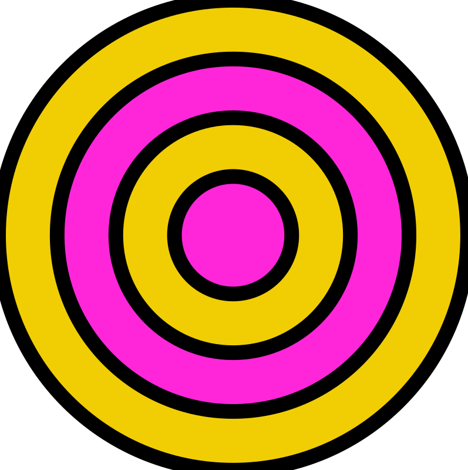
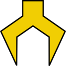

## İzleme Talimatları

### Yakıt Çıkışı

Bu yıl izlemenin en büyük görevi, robotun hedefine ulaştırdığı yakıtı saymaktır. Olan herhangi bir yakıtı sayın

- ateş edilmiş
- yerleştirilmiş
- itilmiş
- dozerle işlenmiş

**Saymayın** yakıtı

- hedefi ıskalamış
- hub kapalıyken hub içine ateş edilmiş

Yakıt için birkaç olası hedef vardır:

- hub (hub aktif olduğunda puanlar kazandığı yer)
- ittifak bölgesindeki zemine dökülmüş
- tezgahta beslenmiş
- tarafsız bölgeden ittifak bölgesine taşınmış (geçiştirilmiş veya itilmiş)
- rakip bölgeden tarafsız bölgeye taşınmış (geçiştirilmiş veya itilmiş)
- rakip bölgeden ittifak bölgesine geçiştirilmiş

Yakıt sayımı için üç düğme vardır. Bunlar sarı (yakıt renkli) dairelerdir.

- 1 — bir robot bir yakıtı hedefe vurduğunda
- 5 — bir robot beş yakıtı hedefe vurduğunda
- 10 — bir robot on yakıtı hedefe vurduğunda

### Bölge ve Hedef Takibi

Robot bölgeler arasında hareket ederken, robotun hangi bölgeye hareket ettiğini takip etmek için tımsekler ve çukurlar üzerindeki okları  basın.

Robot bir bölgeye girdiğinde, yakıt için en olası hedef otomatik olarak seçilecektir :

- İttifak bölgesi — hub
- Tarafsız bölge — ittifak bölgesi
- Rakip bölgesi — ittifak bölgesi

Etkinleştirmek için farklı bir etkin olmayan hedefe  tıklayın.

### Otoda Toplama

Sadece otoda,  simgesine tıklayarak robotun Depodan veya Tezgahtan yakıt topladığını işaretleyin. Bu, robotun orada topladığını bilmek için sadece açık/kapalıdır, toplanan yakıtı saymanız gerekmez.

### Tırmanış Seviyesi

Tırmanış seviyesini kaydetmek için robotun tırmandığı her seviye için Kuleye tıklayın. Robot bir basamağa ulaştığında tıklarsanız, tırmanış süresi bilgisi alacağız.

### Hataları Geri Alma

Otoda ve tele'de basılan son düğmeyi geri almanıza izin verecek bir Geri Al düğmesi vardır.

### Oyun Sonu

Maçın sonunda, oyun sonu sekmesine tıklayın ve robotunuzun maçta nasıl performans gösterdiği hakkında ek sorulara cevap verin.

### Verilerinizi Kaydetme

İşiniz bittiğinde verileri kaydetmek için alttaki düğmelerden birini kullanın. Önerilen düğme büyütülecektir — genellikle bu, bir sonraki maça geçmek için düğme olacaktır, ancak bazı durumlarda uygulama verilerinizi izleme merkezine yüklemenizi önerecektir. Kablosuz bir ağda değilseniz, verilerinizi yüklemek için cihazınızı merkeze takmanız gerekecektir.
